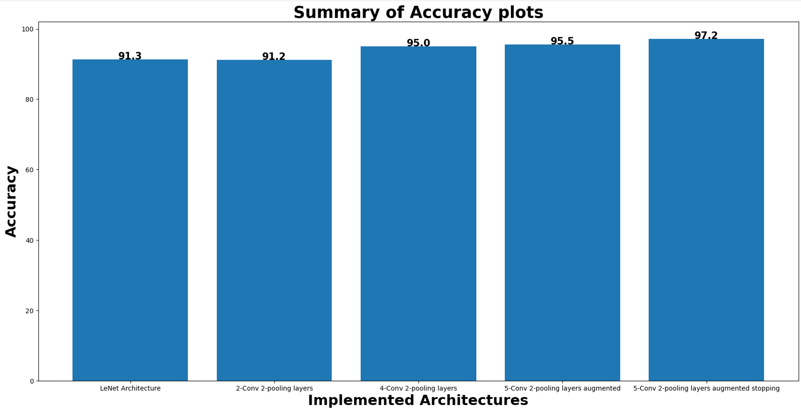

## Traffic Sign Recognition System using Deep Convolutional Neural Network(CNN)

###Requirements:
* Knowledge of Python programming language and CNN.
* German traffic sign recognition benchmark (GTSRB) dataset (Stallkamp, et al., 2011).

---
Contents:
- [x] [function file](func.py): contains functions to extract the train and test data, preprocess train set, and one-hot encode the labels. 
- [x] [training file](training.py): trains the network using data augmentation and early stopping to prevent overfitting.
- [x] [test file](test.py): used to test the network.

---
* Final model consisted of 13 layers. That is, 5 conv layers, 2 pooling layers, 3 dropout layers, 2 fully connected layers with data augmentation and early stopping. 
* Convolutional kernels: 60 and 30.
* Filter sizes: 5 x 5 and 3 x 3.

*Screenshots* 

 | 
-------------------------- | --------------------------
 | 
 | 

